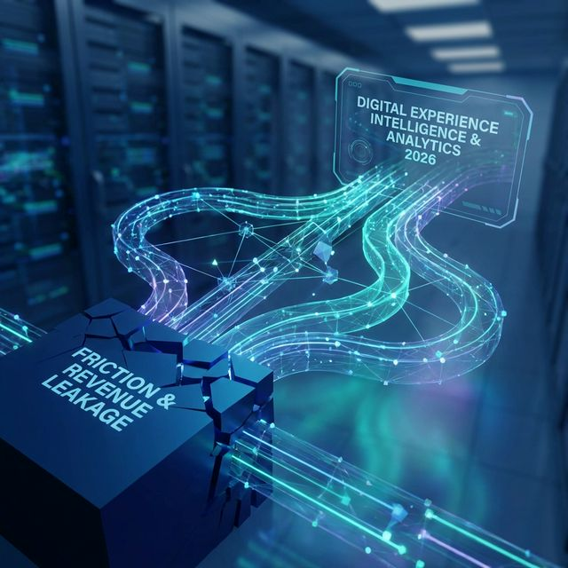

# Post para LinkedIn: A Era Tagless em DXI

Você sabe **exatamente** onde a sua receita digital está vazando hoje? 📉

Em 2026, com os custos de aquisição e a complexidade das jornadas cada vez maiores, líderes de E-commerce, Produto e CX não têm mais tempo (nem orçamento) para "achar" onde o cliente abandona o funil. 

O analytics tradicional mostrava *o que* aconteceu. Mas entender o **porquê** envolvia dias de trabalho da engenharia criando novas tags e esperando os dados acumularem.

Com a arquitetura **Tagless** da **Glassbox**, nós aposentamos o tagueamento manual para focar naquilo que realmente importa: resultados reais e ágeis.

Nossa plataforma grava 100% das interações (sem pesar pro seu time de TI) e usa uma IA Agente para encontrar os pontos cegos e os atritos da sua jornada — quantificando imediatamente o impacto na receita. 

Encontrou um bug ou queda na conversão de checkout? Nossa IA (*Voice of the Silent* e os *Friction Alerts*) localiza o evento exato e mostra quantos outros clientes "silenciosos" sofreram do mesmo problema, reduzindo de dezenas para minutos o tempo de resolução (MTTR).

Sem adivinhação. Sem depender de TI para criar tags.
Apenas autonomia e otimização com dados empíricos.

Quer acelerar o ROI digital do seu time até o final de 2026? Comenta aqui ou me chama no inbox e eu te mostro como funciona na prática. 👇

#TransformaçãoDigital #CustomerExperience #Analytics #Glassbox #Ecommerce2026 #DataDriven #DigitalExperienceIntelligence
