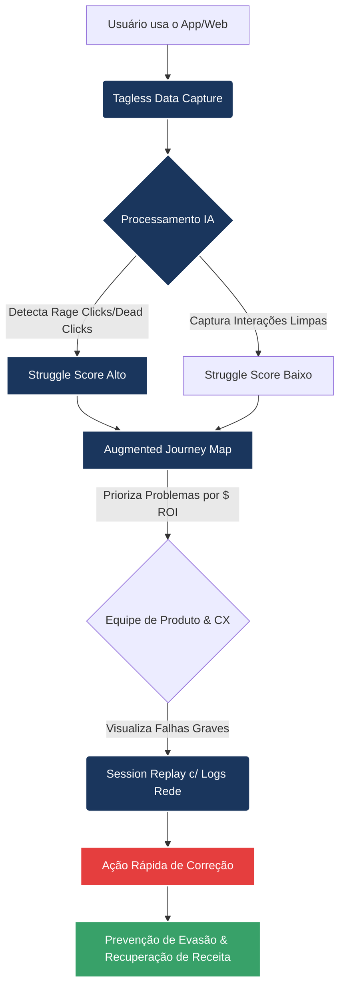

# Digital Experience Intelligence: O Fim das Deduções no Analytics (2026)

### ProductManagement #UXStrategy #DigitalExperience #AppOptimization #CustomerExperience #SessionReplay #DataDrivenProduct #Glassbox

---

### Introdução: Por Que "O Que" Aconteceu Não Importa Mais

Em 2026, você abre o seu Google Analytics ou ferramenta de Produto padrão e a tela está vermelha: **Sua taxa de conversão do mês caiu 12% no aplicativo.** 

O painel te mostra perfeitamente *o que* aconteceu (a queda), *onde* aconteceu (na tela de configuração de pagamento) e *quando* aconteceu. 
Mas ele te deixa completamente cego em relação à pergunta de um milhão de dólares: **Por quê?**

A jornada tradicional do usuário digital raramente é linear, e as ferramentas clássicas baseadas em marcações *(tags)* manuais estão falhando em capturar a fricção real das aplicações modernas (Single Page Apps, React Native, Flutter). É aqui que entra a evolução para o **Digital Experience Intelligence (DXI)**, liderado por plataformas como a Glassbox.

---

### 1. Tagless Data Capture: O Fim da Manutenção de Tags

A maior dor silenciosa das equipes de Produto e Engenharia é a instrumentação de dados. Para cada novo botão, funcionalidade ou fluxo, é necessário codificar uma "tag". Se o desenvolvedor esquecer de colocar a tag na terceira variação de um teste A/B, ou se o ID de um elemento do React Native mudar na compilação, você simplesmente perde todos os dados daquele mês.

A solução? **A Captura Tagless (Sem Etiquetas).** 

- **Como Funciona:** Um SDK captura 100% dos eventos (scrolls, rage clicks, toques, deslizes) diretamente no lado do cliente (app ou web) e no servidor. 
- **O Impacto:** Mesmo que um fluxo de login seja atualizado amanhã sem aviso, a captura Tagless já está monitorando. Isso não apenas zera o backlog de "tarefas de analitycs" da engenharia, mas permite análise *retroativa*. Descobriu um erro crítico hoje? Você pode analisar os dados do mês passado sem precisar ter configurado nada antecipadamente.

*(Veja a Imagem 1: Representação de fluxo de captura automatizada Tagless)*

---

### 2. Session Replay Avançado: A Prova Definitiva

Saber que o cliente abandonou a tela é inútil sem o contexto. Mas saber que o cliente tocou no botão "Finalizar Pedido" três vezes, não teve resposta visual, minimizou o aplicativo e não voltou mais, é **ousmável.**

O **Session Replay** tradicional grava a tela. O Session Replay de DXI (Glassbox) grava a interface do usuário **e os bastidores**.
- Ele reproduz o vídeo do que o cliente viu.
- Embaixo do vídeo, ele exibe os *logs de rede, payloads de API (escondendo PII - dados sensíveis automagicamente), e erros de console que ocorreram no exato milissegundo do clique do usuário.*

Isso significa que o time de suporte não precisa mais pedir para o cliente "tirar um print do erro", e o time de engenharia não perde 3 dias tentando recriar um ambiente complexo para reproduzir o bug.

*(Veja a Imagem 2: Session Replay mostrando a conexão entre interface UI e logs de API ocultos)*

---

### 3. Struggle Score: IA Identificando Frustração Silenciosa

O consumidor moderno sofre em silêncio. Um clique em um "botão morto" que não faz nada (*dead click*) ou toques furiosos frustrados na tela (*rage taps*) normalmente não geram tickets no SAC. O usuário apenas vai para o concorrente.

A grande inovação é quantificar essa frustração usando IA: o **Struggle Score (Índice de Dificuldade)**.

Ao invés de você cruzar as mãos e esperar alguém reclamar, o aprendizado de máquina analisa trilhões de micro-interações cruzadas:
1. Identifica os Rage Taps e Formulários Abandonados (Form Zigzagging).
2. Adiciona o peso da métrica de latência da página.
3. Classifica a sessão em um placar de Risco.

As equipes de CX não precisam mais filtrar gravações aleatoriamente. Elas vão direto nas 50 sessões que o algoritmo agrupou como "Struggle Score Alto na Tela de Checkout".

*(Veja a Imagem 3: O medidor de atrito convertendo gestos em dados claros)*

---

### O Augmented Journey Map e Seus Resultados Cifrados

Isso culmina no **Augmented Journey Map (AJM)**. Ele cruza esses atritos com a perda financeira. Se um campo de CEP travado no iOS afeta 4% dos usuários, o sistema já diz: *"Isso está lhe custando US$ 850.000 ao ano"*.

Resultados do uso de DXI mapeados por plataformas analíticas nos últimos 24 meses não deixam dúvidas sobre o Retorno Estratégico do fim das adivinhações cegas:
- **Resgate de € 1,6 Milhão na Europa:** Um validador de formulário silenciosamente bloqueava acentos e caracteres especiais no fechamento de contas de um grande banco espanhol. Com Struggle Score e Replay de Sessões a correção rendeu um ganho anual imediato de € 1,6 milhão em clientes que não converteram antes.
- **Proteção de US$ 20 Milhões em Empréstimos (State Bank):** Uma divergência invisível entre as opções fornecidas pelo backend e a tela inicial resultava em rage clicks intensos na seleção de cotas de crédito. Detectado e corrigido nos primeiros minutos da campanha, poupou a perda severa de originação de capital. 

O Analytics tradicional nos trouxe até as portas da decisão. O Digital Experience Intelligence é quem vai abrir ela e destrancar a conversão. Como a sua plataforma atual detecta o que o usuário faz quando a tela trava?

*(Infográfico Sugerido no primeiro comentário: O fluxo de arquitetura Tagless da visão ao ROI)*

---
*Você é Product Manager ou CX liderando jornadas mobile/híbridas hoje? Quantas horas por semana seu time gasta buscando "por que a conversão caiu"?*

---
### O Fluxo da Experiência Digital (DXI)

